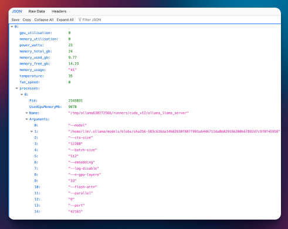

# NVApi

A lightweight API that returns Nvidia GPU utilisation information.




- [NVApi](#nvapi)
  - [Usage](#usage)
    - [Docker Container](#docker-container)
    - [Local Installation](#local-installation)
  - [API Endpoints](#api-endpoints)
    - [`/`](#)
  - [Query Parameters](#query-parameters)
  - [Example Response](#example-response)
    - [Automated Power Limiting](#automated-power-limiting)
      - [Configuration](#configuration)
      - [Example Configuration](#example-configuration)
      - [Behaviour](#behaviour)
      - [Partial Configuration Behaviour](#partial-configuration-behaviour)
      - [Total Power Cap Only Configuration](#total-power-cap-only-configuration)
    - [Home Assistant Integration](#home-assistant-integration)
  - [NVApi-Tray GUI](#nvapi-tray-gui)
  - [License](#license)

## Usage

### Docker Container

_Note: The Dockerfile is a work in progress, the current container image is bloated and not optimised for size yet._

The application can be run as a container:

```shell
docker build -t nvapi:latest .
```

Or using docker-compose see [docker-compose.yml](docker-compose.yml) for an example configuration.

### Local Installation

To run the API, use the following command:

```shell
go run main.go -port 9999 -rate 1
```

This will start the API on port 9999 with a rate limit of 1 request per second.

## API Endpoints

### `/`

Returns the current GPU utilisation information in JSON format.

## Query Parameters

* `port`: The port number to listen on (default: 9999)
* `rate`: The minimum number of seconds between requests (default: 3)

## Example Response

```shell
curl http://localhost:9999/gpu
```

```json
[{
  "index": 0,
  "name": "NVIDIA GeForce RTX 3090",
  "gpu_utilisation": 0,
  "memory_utilisation": 0,
  "power_watts": 22,
  "memory_total_gb": 24,
  "memory_used_gb": 22.44,
  "memory_free_gb": 1.56,
  "memory_usage_percent": 94,
  "temperature": 38,
  "fan_speed": 0,
  "power_limit_watts": 360,
  "processes": [{
    "Pid": 2409765,
    "UsedGpuMemoryMb": 22650,
    "Name": "cuda_v12/ollama_llama_server",
    "Arguments": ["--model", "/models/mixtral", "--ctx-size", "2048", "--batch-size", "512", "--embedding", "--log-disable", "--n-gpu-layers", "26", "--flash-attn", "--parallel", "1", "--port", "39467"]
  }]
}, {
  "index": 1,
  "name": "NVIDIA RTX A4000",
  "gpu_utilisation": 0,
  "memory_utilisation": 0,
  "power_watts": 14,
  "memory_total_gb": 15.99,
  "memory_used_gb": 13.88,
  "memory_free_gb": 2.11,
  "memory_usage_percent": 87,
  "temperature": 35,
  "fan_speed": 41,
  "power_limit_watts": 140,
  "processes": [{
    "Pid": 2409765,
    "UsedGpuMemoryMb": 13934,
    "Name": "cuda_v12/ollama_llama_server",
    "Arguments": ["--model", "/models/mixtral", "--ctx-size", "2048", "--batch-size", "512", "--embedding", "--log-disable", "--n-gpu-layers", "26", "--flash-attn", "--parallel", "1", "--port", "39467"]
  }],
}]
```

### Automated Power Limiting

NVApi supports automated power limiting based on GPU temperature and total power consumption. This feature allows you to set different power limits for each GPU that will be automatically applied as the temperature changes, while also respecting a total power cap for all GPUs combined. You can configure this feature using environment variables.

#### Configuration

To set up automated power limiting, you need to set the following environment variables:

For each GPU:

- `GPU_<id>_LOW_TEMP`: The temperature threshold for low power limit (in °C)
- `GPU_<id>_MEDIUM_TEMP`: The temperature threshold for medium power limit (in °C)
- `GPU_<id>_LOW_TEMP_LIMIT`: The power limit to apply when temperature is at or below `LOW_TEMP` (in watts)
- `GPU_<id>_MEDIUM_TEMP_LIMIT`: The power limit to apply when temperature is between `LOW_TEMP` and `MEDIUM_TEMP` (in watts)
- `GPU_<id>_HIGH_TEMP_LIMIT`: The power limit to apply when temperature is above `MEDIUM_TEMP` (in watts)

Replace `<id>` with the index of the GPU (starting from 0).

Global settings:

- `GPU_TEMP_CHECK_INTERVAL`: The interval between temperature checks and power limit applications (in seconds, default is 5)
- `GPU_TOTAL_POWER_CAP`: The maximum total power consumption allowed for all GPUs combined (in watts)

#### Example Configuration

Here's an example configuration for a system with two GPUs:

```bash
export GPU_TEMP_CHECK_INTERVAL=10
export GPU_TOTAL_POWER_CAP=400
export GPU_0_LOW_TEMP=40
export GPU_0_MEDIUM_TEMP=70
export GPU_0_LOW_TEMP_LIMIT=135
export GPU_0_MEDIUM_TEMP_LIMIT=120
export GPU_0_HIGH_TEMP_LIMIT=100
export GPU_1_LOW_TEMP=45
export GPU_1_MEDIUM_TEMP=75
export GPU_1_LOW_TEMP_LIMIT=140
export GPU_1_MEDIUM_TEMP_LIMIT=125
export GPU_1_HIGH_TEMP_LIMIT=110
```

With this configuration:

1. Temperature and power limits will be checked every 10 seconds.
2. The total power consumption of all GPUs combined will not exceed 400W.
3. For GPU 0:
   - If temperature is 40°C or below, the power limit will be set to 135W
   - If temperature is between 41°C and 70°C, the power limit will be set to 120W
   - If temperature is above 70°C, the power limit will be set to 100W
4. For GPU 1:
   - If temperature is 45°C or below, the power limit will be set to 140W
   - If temperature is between 46°C and 75°C, the power limit will be set to 125W
   - If temperature is above 75°C, the power limit will be set to 110W

Note: If you're running nvAPI in a container and want to configure power limits, you need to grant `SYS_ADMIN` to allow setting power limits on the devices, e.g:

```yaml
services:
  nvapi:
    image: ghcr.io/sammcj/nvapi/nvapi:latest
    pid: host # so we can lookup process names
    ports:
      - 9999:9999
    environment:
      GPU_TEMP_CHECK_INTERVAL: 5
      GPU_TOTAL_POWER_CAP: 600
      GPU_0_LOW_TEMP: 50
      GPU_0_MEDIUM_TEMP: 80
      GPU_0_LOW_TEMP_LIMIT: 370
      GPU_0_MEDIUM_TEMP_LIMIT: 360
      GPU_0_HIGH_TEMP_LIMIT: 300
      GPU_1_LOW_TEMP: 50
      GPU_1_MEDIUM_TEMP: 78
      GPU_1_LOW_TEMP_LIMIT: 140
      GPU_1_MEDIUM_TEMP_LIMIT: 122
      GPU_1_HIGH_TEMP_LIMIT: 100
    cap_add:
      - SYS_ADMIN # grant permissions to set power limits
```

You may alternatively use the GPU UUID instead of the index, e.g:

```yaml
GPU_14b70e9a-19a8-bc20-fd3e-0f3a1430dc24_LOW_TEMP: 80
GPU_14b70e9a-19a8-bc20-fd3e-0f3a1430dc24_MEDIUM_TEMP: 84
GPU_14b70e9a-19a8-bc20-fd3e-0f3a1430dc24_LOW_TEMP_LIMIT: 140
GPU_14b70e9a-19a8-bc20-fd3e-0f3a1430dc24_MEDIUM_TEMP_LIMIT: 120
```

#### Behaviour

The program will automatically adjust the power limits as the GPU temperatures change during operation. This helps manage power consumption and heat generation based on the current workload and thermal conditions.

Additionally, the program will ensure that the total power consumption of all GPUs does not exceed the specified `GPU_TOTAL_POWER_CAP`. If the total power consumption approaches 98% of the cap, a warning will be logged. If the total power consumption exceeds the cap, the power limits of all GPUs will be proportionally reduced to meet the cap.

If you don't set these environment variables, the automated power limiting feature will not be active, and the GPUs will use their default power limits.

#### Partial Configuration Behaviour

If you provide only some of the environment variables, the following behaviour applies:

- If any of the five required variables for a GPU (`LOW_TEMP`, `MEDIUM_TEMP`, `LOW_TEMP_LIMIT`, `MEDIUM_TEMP_LIMIT`, `HIGH_TEMP_LIMIT`) are missing, the automated power limiting feature will not be activated for that specific GPU. The GPU will use its default power management settings.
- If all five variables are provided for a GPU, the feature will be active for that GPU, regardless of whether variables are set for other GPUs in the system.
- The `GPU_TEMP_CHECK_INTERVAL` is a global setting. If not provided, it defaults to 5 seconds. This interval applies to all GPUs for which the feature is active.
- The `GPU_TOTAL_POWER_CAP` is optional. If not provided, there will be no limit on the total power consumption of all GPUs combined.
- You can activate the feature for some GPUs and not others by providing complete sets of variables for the desired GPUs only.

#### Total Power Cap Only Configuration

You can set a total power cap for all GPUs without specifying individual temperature-based limits. To do this, only set the `GPU_TOTAL_POWER_CAP` environment variable:

```bash
export GPU_TOTAL_POWER_CAP=400
```

1. The total power cap is applied based on the actual power consumption of all GPUs, not their maximum power limits.
2. If the total actual power consumption exceeds the cap:
   - Power limits are adjusted proportionally to each GPU's current consumption.
   - GPUs that aren't consuming power (idle GPUs) are not affected.
   - Busy GPUs may retain more of their power budget, allowing for efficient use of available power.
3. When the total power consumption is below the cap:
   - All GPUs are allowed to use up to their maximum power limits.
   - This allows individual GPUs to use more power when others are idle, as long as the total consumption remains under the cap.
4. If the total power consumption approaches 98% of the cap, a warning is logged.

This approach ensures that the total power cap is respected while allowing for flexible and efficient use of available power across all GPUs.

### Home Assistant Integration

Example of using the API to integrate with Home Assistant:

```yaml
sensors:

- platform: rest
  name: "NAS GPU Utilisation - RTX3090"
  resource: http://localhost:9999
  unit_of_measurement: "%"
  unique_id: gpu_0
  scan_interval: 30
  json_attributes_path: '$.0'
  json_attributes:
    - name
    - index
    - gpu_utilisation
    - memory_utilisation
    - memory_used_gb
    - memory_free_gb
    - power_watts
    - power_limit_watts
    - temperature
    - fan_speed
    - processes
  value_template: '{{ value_json[0].memory_utilisation }}'

- platform: rest
  name: "NAS GPU Utilisation - RTX A4000"
  resource: http://localhost:9999
  unit_of_measurement: "%"
  unique_id: gpu_1
  scan_interval: 30
  json_attributes_path: '$.1'
  json_attributes:
    - name
    - index
    - gpu_utilisation
    - memory_utilisation
    - memory_used_gb
    - memory_free_gb
    - power_watts
    - power_limit_watts
    - temperature
    - fan_speed
    - processes
  value_template: '{{ value_json[1].memory_utilisation }}'
```

And you might integrate this into a dashboard (as pictured above) like so:

```yaml
title: GPUs
path: gpus
icon: mdi:expansion-card
type: sections
max_columns: 3
sections:
  - type: grid
    cards:
      - type: custom:layout-card
        layout_type: masonry
        layout: {}
        cards:
          - type: gauge
            entity: sensor.nas_gpu_power_rtx3090
            unit: W
            name: RTX3090 Power
            min: 20
            max: 390
            severity:
              green: 30
              yellow: 350
              red: 380
            needle: true
          - type: gauge
            entity: sensor.nas_gpu_temperature_rtx3090
            max: 92
            severity:
              green: 60
              yellow: 80
              red: 90
            needle: true
            min: 0
            unit: ℃
          - type: grid
            columns: 2
            cards:
              - type: gauge
                entity: sensor.nas_gpu_utilisation_rtx3090
                max: 100
                severity:
                  green: 80
                  yellow: 90
                  red: 95
                needle: true
                min: 0
                unit: "%"
              - type: gauge
                entity: sensor.nas_gpu_memory_used_rtx3090
                unit: GB
                max: 24
                severity:
                  green: 20
                  yellow: 22
                  red: 23.9
                needle: true
                min: 0
      - type: custom:apexcharts-card
        header:
          show: true
          title: RTX 3090
          show_states: true
          colorize_states: true
        apex_config:
          chart:
            height: 300px
            update_interval: 2m
        graph_span: 12h
        series:
          - entity: sensor.nas_gpu_utilisation_rtx3090
            stroke_width: 2
          - entity: sensor.nas_gpu_temperature_rtx3090
            stroke_width: 3
          - entity: sensor.nas_gpu_power_rtx3090
            stroke_width: 3
    title: GPU 0 - RTX3090
  - type: grid
    cards:
      - type: custom:layout-card
        layout_type: masonry
        layout: {}
        cards:
          - type: gauge
            entity: sensor.nas_gpu_power_rtx_a4000_a
            unit: W
            name: RTX A4000 A Power
            min: 20
            max: 140
            severity:
              green: 25
              yellow: 120
              red: 130
            needle: true
          - type: gauge
            entity: sensor.nas_gpu_temperature_rtx_a4000_a
            max: 92
            severity:
              green: 60
              yellow: 80
              red: 90
            needle: true
            min: 0
            unit: ℃
          - type: grid
            columns: 2
            cards:
              - type: gauge
                entity: sensor.nas_gpu_utilisation_rtx_a4000_a
                max: 100
                severity:
                  green: 80
                  yellow: 90
                  red: 95
                needle: true
                min: 0
                unit: "%"
              - type: gauge
                entity: sensor.nas_gpu_memory_used_rtx_a4000_a
                unit: GB
                max: 24
                severity:
                  green: 20
                  yellow: 22
                  red: 23.9
                needle: true
                min: 0
      - type: custom:apexcharts-card
        header:
          show: true
          title: RTX A4000 A
          show_states: true
          colorize_states: true
        apex_config:
          chart:
            height: 300px
            update_interval: 2m
        graph_span: 12h
        series:
          - entity: sensor.nas_gpu_1_power_watts
            stroke_width: 3
          - entity: sensor.nas_gpu_utilisation_rtx_a4000_a
            stroke_width: 2
          - entity: sensor.nas_gpu_temperature_rtx_a4000_a
            stroke_width: 3
    title: GPU 1 - RTX A4000 A
  - type: grid
    cards:
      - type: custom:layout-card
        layout_type: masonry
        layout: {}
        cards:
          - type: gauge
            entity: sensor.nas_gpu_power_rtx_a4000_b
            unit: W
            name: RTX A4000 B Power
            min: 20
            max: 140
            severity:
              green: 25
              yellow: 120
              red: 130
            needle: true
          - type: gauge
            entity: sensor.nas_gpu_temperature_rtx_a4000_b
            max: 92
            severity:
              green: 60
              yellow: 80
              red: 90
            needle: true
            min: 0
            unit: ℃
          - type: grid
            columns: 2
            cards:
              - type: gauge
                entity: sensor.nas_gpu_utilisation_rtx_a4000_b_2
                max: 100
                severity:
                  green: 80
                  yellow: 90
                  red: 95
                needle: true
                min: 0
                unit: "%"
              - type: gauge
                entity: sensor.nas_gpu_memory_used_rtx_a4000_b
                unit: GB
                max: 24
                severity:
                  green: 20
                  yellow: 22
                  red: 23.9
                needle: true
                min: 0
      - type: custom:apexcharts-card
        header:
          show: true
          title: RTX A4000 B
          show_states: true
          colorize_states: true
        apex_config:
          chart:
            height: 300px
            update_interval: 2m
        graph_span: 12h
        series:
          - entity: sensor.nas_gpu_utilisation_rtx_a4000_b
            stroke_width: 2
          - entity: sensor.nas_gpu_temperature_rtx_a4000_b
            stroke_width: 3
    title: GPU 2 - RTX A4000 B
cards: []
```

## NVApi-Tray GUI

A simple GUI application that displays the GPU utilisation information from the API.


This is a work in progress but can be built from the `NVApi-GUI` directory.

```shell
cd NVApi-GUI
go build
```

## License

Copyright 2024 Sam McLeod

This project is licensed under the MIT License. See [LICENSE](LICENSE) for details.
